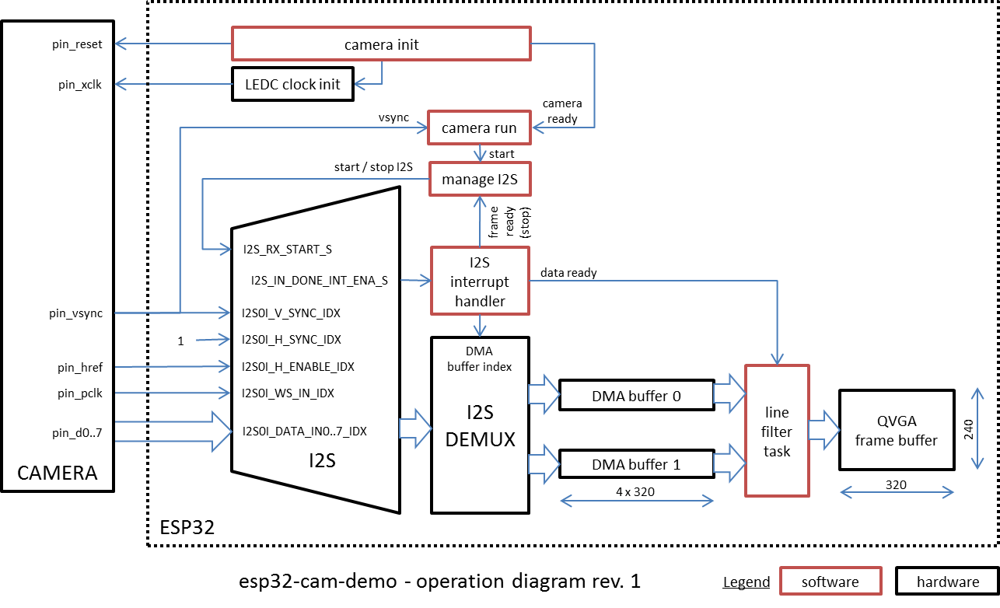

#
ESP32 Camera Demo

Code provided in this repository gets the image from camera and prints it out as ASCII art to the serial port.

## Build Status

[](https://travis-ci.org/krzychb/esp32-cam-demo)

## Table of Contents
- [Components](#components)
  - [ESP32](#esp32)
  - [Camera](#camera)
  - [Esp-idf](#esp-idf)
- [Quick Start](#quick-start)
  - [Connect](#connect)
  - [Flash](#flash)
  - [Shoot](#shoot)
- [How it Works](#how-it-works)
  - [Software](#software)
  - [Operation](#operation)
- [Tweak](#tweak)
- [Troubleshooting](#troubleshooting)
- [Showcase](#showcase)
- [Next Steps](#next-steps)
- [Contribute](#contribute)
- [Acknowledgments](#acknowledgments)

## Components

To make this code work, you need the following components:

* [ESP32](https://espressif.com/en/products/hardware/esp32/overview) module
* Camera module
* PC with [esp-idf](https://github.com/espressif/esp-idf)

See the following sections for more details.

### ESP32

Any ESP32 module should work, if it has sufficient number of GPIO pins available to interface with camera. See section [Connect](#connect) for more details.

If you are an owner of [ESP-WROVER V1 (aka DevKitJ)](http://dl.espressif.com/dl/schematics/ESP32-DevKitJ-v1_sch.pdf), then camera connector is already broken out.

### Camera

This example has been tested with OV7725 camera module. Use it, if this is your first exposure to interfacing a microcontroller with a camera.

Other OV7xxx series should work as well, with some changes to camera configuration code. OV5xxx can work too, but it is advisable to choose the ones which support RGB or YUV 8-bit wide output bus. The ones which only output 10-bit raw data may be a bit harder to work with. Also choose the camera which can output a scaled down (QVGA or VGA) image. Use of larger frame buffers will require external SPI RAM.

### Esp-idf

Configure your PC according to [ESP32 Documentation](http://esp-idf.readthedocs.io/en/latest/?badge=latest). [Windows](http://esp-idf.readthedocs.io/en/latest/windows-setup.html), [Linux](http://esp-idf.readthedocs.io/en/latest/linux-setup.html) and [Mac OS](http://esp-idf.readthedocs.io/en/latest/macos-setup.html) are supported. If this is you first exposure to ESP32 and [esp-idf](https://github.com/espressif/esp-idf), then get familiar with [01_hello_world](https://github.com/espressif/esp-idf/tree/master/examples/01_hello_world) and [02_blink](https://github.com/espressif/esp-idf/tree/master/examples/02_blink) examples. Make them work and understand before proceeding further.

## Quick Start

If you have your components ready, follow this section to [connect](#connect) the camera to ESP32 module, [flash](#flash) application to the ESP32 and finally [shoot](#shoot) and display the image.

### Connect

Specific pins used in this example to connect ESP32 and camera are shown in table below. Note that pinout can be adjusted to some extent in software.

Important: Make the connections short or you are likely to get noisy or even not legible images. More on that is discussed in section [Showcase](#showcase)

| Interface | Camera Pin | ESP32 Pin |
| --- | --- | --- |
| SCCB Clock | SIDC | IO27 |
| SCCB Data | SIOD | IO26 |
| Camera System Clock | XCLK | IO21 |
| Vertical Sync | VSYNC | IO25 |
| Horizontal Reference | HREF | IO23 |
| System Clock | XCLK | IO21 |
| Pixel Clock | PCLK | IO22 |
| Pixel Data Bit 0 | D2 | IO4 |
| Pixel Data Bit 1 | D3 | IO5 |
| Pixel Data Bit 2 | D4 | IO18 |
| Pixel Data Bit 3 | D5 | IO19 |
| Pixel Data Bit 4 | D6 | IO36 |
| Pixel Data Bit 5 | D7 | IO39 |
| Pixel Data Bit 6 | D8 | IO34 |
| Pixel Data Bit 7 | D9 | IO35 |
| Camera Reset | RESET | IO2 |
| Camera Power Down | PWDN | *see Note 2* |
| Power Supply 3.3V | 3V3 | 3V3 |
| Ground | GND | GND |

Notes:

1. **Camera pin** column refers to pinout on OV7725 camera module
2. **Camera Power Down** pin does not need to be connected to ESP32 GPIO. Instead it may be pulled down to ground with 10 kOhm resistor.
3. OV7725 supports 10 bit image pixels. In this example the upper 8 bits are processed and saved. The pins corresponding with LSB are marked D0 and D1 and are left not connected.

If you have [ESP-WROVER V1 (aka DevKitJ)](http://dl.espressif.com/dl/schematics/ESP32-DevKitJ-v1_sch.pdf), then camera connector is already broken out and labeled Camera / JP4. Solder 2.54 mm / 0.1" double row, 18 pin socket in provided space and plug the camera module right into it. Line up 3V3 and GND pins on camera module and on ESP-WROVER. D0 and D1 should be left not connected outside the socket.

### Flash

Clone the code provided in this repository to your PC, compile with the latest [esp-idf](https://github.com/espressif/esp-idf) installed from GitHub and download to the module.

If all h/w components are connected properly you are likely to see the following message during download:

```
Krzysztof@tdk-kmb-op780 MSYS /esp/esp32-cam-demo
$ make flash
Flashing binaries to serial port com18 (app at offset 0x10000)...
esptool.py v2.0-dev
Connecting...

A fatal error occurred: Failed to connect to ESP32: Timed out waiting for packet header
make: *** [C:/msys32/esp-idf/components/esptool_py/Makefile.projbuild:48: flash] Error 2
```
This is due to a pullup on the camera reset line. It is stronger than the internal pull-down on `GPIO2` of the ESP32, so the chip cannot go into programming mode.

There are couple of options how to resolve this issue:

* If you are using ESP-WROVER V1 then connect GPIO2 to GND while flashing.
* Power down the camera module by removing it from the socket (ESP-WROVER V1) or by uplugging 3.3V wire.
* Map Camera Reset line to another GPIO pin on ESP32, for instance `GPIO15`.

### Shoot

Once module is loaded with code, open a serial terminal.

Camera demo application will first configure XCLK output that is timing operation of the camera chip.

```
D (1527) camera: Enabling XCLK output
I (1527) ledc: LEDC_PWM CHANNEL 0|GPIO 21|Duty 0004|Time 0
```
This clock is also timing output of pixel data on camera output interface - see I2S and DMA described below.

Then [SCCB](http://www.ovt.com/download_document.php?type=document&DID=63) interface is set up:

```
D (1527) camera: Initializing SSCB
I (1537) gpio: GPIO[26]| InputEn: 0| OutputEn: 1| OpenDrain: 0| Pullup: 0| Pulldown: 0| Intr:0
I (1537) gpio: GPIO[27]| InputEn: 0| OutputEn: 1| OpenDrain: 0| Pullup: 0| Pulldown: 0| Intr:0
I (1547) gpio: GPIO[26]| InputEn: 1| OutputEn: 0| OpenDrain: 0| Pullup: 1| Pulldown: 0| Intr:0
I (1557) gpio: GPIO[27]| InputEn: 1| OutputEn: 0| OpenDrain: 0| Pullup: 1| Pulldown: 0| Intr:0
```

In next step the communication with camera should be established. ESP will retrieve camera's address and signature.

```
D (1567) camera: Resetting camera
D (1587) camera: Searching for camera address
D (1587) camera: Detected camera at address=0x21
D (1587) camera: Camera PID=0x77 VER=0x21 MIDL=0x7f MIDH=0xa2
```

If communication fails, the following message is shown:

```
E (1076) camera: Camera address not found
E (1076) camera_demo: Camera init failed with error = 131073
```

If communication with camera module is established, ESP will reset the camera sensor and reserve memory for video frame buffer:

```
D (1587) camera: Doing SW reset of sensor
D (1647) camera: Setting frame size at 320x240
D (1677) camera: Allocating frame buffer (320x240, 76800 bytes)
```

Image from camera is retrieved using I2S communication for all eight pixel bits at once and saved in memory line by line. Log below shows completion of initialization steps for I2S and DMA:

```
D (1677) camera: Initializing I2S and DMA
I (1677) gpio: GPIO[19]| InputEn: 1| OutputEn: 0| OpenDrain: 0| Pullup: 0| Pulldown: 0| Intr:0
I (1677) gpio: GPIO[36]| InputEn: 1| OutputEn: 0| OpenDrain: 0| Pullup: 0| Pulldown: 0| Intr:0
I (1687) gpio: GPIO[18]| InputEn: 1| OutputEn: 0| OpenDrain: 0| Pullup: 0| Pulldown: 0| Intr:0
I (1697) gpio: GPIO[39]| InputEn: 1| OutputEn: 0| OpenDrain: 0| Pullup: 0| Pulldown: 0| Intr:0
I (1707) gpio: GPIO[5]| InputEn: 1| OutputEn: 0| OpenDrain: 0| Pullup: 0| Pulldown: 0| Intr:0
I (1717) gpio: GPIO[34]| InputEn: 1| OutputEn: 0| OpenDrain: 0| Pullup: 0| Pulldown: 0| Intr:0
I (1727) gpio: GPIO[17]| InputEn: 1| OutputEn: 0| OpenDrain: 0| Pullup: 0| Pulldown: 0| Intr:0
I (1737) gpio: GPIO[35]| InputEn: 1| OutputEn: 0| OpenDrain: 0| Pullup: 0| Pulldown: 0| Intr:0
I (1747) gpio: GPIO[22]| InputEn: 1| OutputEn: 0| OpenDrain: 0| Pullup: 0| Pulldown: 0| Intr:0
I (1757) gpio: GPIO[26]| InputEn: 1| OutputEn: 0| OpenDrain: 0| Pullup: 0| Pulldown: 0| Intr:0
I (1767) gpio: GPIO[21]| InputEn: 1| OutputEn: 0| OpenDrain: 0| Pullup: 0| Pulldown: 0| Intr:0
D (1777) intr_alloc: Connected src 32 to int 3 (cpu 0)
D (1777) camera: Allocating DMA buffer #0, size=1280
D (1787) camera: Allocating DMA buffer #1, size=1280
D (1817) camera: Init done
```

Finally ESP32 will retrieve image from camera and show it as ASCII art on serial terminal. Image will be retrieved in a loop once per second.

```
D (1817) camera: Waiting for positive edge on VSYNC
D (1847) camera: Got VSYNC
D (1847) camera: Waiting for frame
D (1887) camera: Frame done
D (1887) camera_demo: Done
|@@ ......... @@@@@@@@@@@@            .@@@@@@@@@@@@@ .. ....... @@@@@@@+. @@@@@@@|
|@@.    ... .+@@@@@@@@@@@@             @@@@@@@@@@@@@ ..      .. @@@@@@@@@@.:.  %@|
|@+         .@@@@@@@@@@@@@             @@@@@@@@@@@@@ ..       . @@@@@@@@@@@......|
|@           @@@@@@@@@@@@@             @@@@@@@@@@@@@.. .      ..@@@@@@@@@@@......|
|@           @@@@@@@@@@@@@             @@@@@@@@@@@@@-...       .@@@@@@@@@@@......|
|:@@@@@@@@@@@            =@@@@@@@@@@@@@             @@@@@@@%=.  @@@@@@@@@@@ .....|
|%@@@@@@@@@@@            %@@@@@@@@@@@@@            .@@@@@@@@@@@@@    .     @@*   |
|@@@@@@@@@@@@            @@@@@@@@@@@@@@             @@@@@@@@@@@@@        . @@@@@@|
|@@@@@@@@@@@%            @@@@@@@@@@@@@@             @@@@@@@@@@@@@          @@@@@@|
|@@@@@@@@@@@-            @@@@@@@@@@@@@@             @@@@@@@@@@@@@          @@@@@@|
|@@@@@@@@@@@             @@@@@@@@@@@@@@             @@@@@@@@@@@@@          @@@@@@|
```

## How it Works

### Software

The core of camera software is contained in `camera` folder and consists of the following files.

* [camera.c](components/camera/camera.c) and [include/camera.h](components/camera/include/camera.h) - main file responsible for configuration of ESP32's GPIO, clock, I2S and DMA to interface with camera module. Once interface is established, it perfroms camera configuration to then retrieve image and save it in ESP32 memory. Access to camera is executed using lower level routines in the following files.

* [ov7725.c](components/camera/ov7725.c), [ov7725.h](components/camera/ov7725.h), [ov7725_regs.h](components/camera/ov7725_regs.h) and [sensor.h](components/camera/sensor.h) - definition of registers of OV7725 to configure camera funcinality. Functions to set register groups to reset camera to default configuration and configure specific functionality like resolution or pixel format. Setting he registers is performed by lower level function in files below.

* [sccb.c](components/camera/sccb.c) and [sccb.h](components/camera/sccb.h) - implementation of [Serial Camera Control Bus (SCCB)](http://www.ovt.com/download_document.php?type=document&DID=63) protocol to set camera registers.

* [twi.c](components/camera/twi.c) and [twi.h](components/camera/twi.h) - implementation of software I2C routines used by SCCB protocol.

* [wiring.c](components/camera/wiring.c) and [wiring.h](components/camera/wiring.h) - the lowest level routines to set GPIO pin mode, set GPIO pin level and delay program execution by required number of ms.

* [component.mk](components/camera/component.mk) - file used by C `make` command to access component during compilation.

* [Kconfig.projbuild](components/camera/Kconfig.projbuild) - file used by `make menuconfig` that provides menu option to switch camera test pattern on / off.

All above files constitute what is called _esp-idf component_ and placed in `components` folder. Esp-idf framework provides `components` folder as a standard place to add modular functionality to a project.

Application starts and the top level control is executed from [app_main.c](main/app_main.c) file located in [main](main) folder.

### Operation

Interconnections between application and h/w internals of ESP32 to acquire an image from the camera is shown on diagram below.



## Tweak

Application is configured to run the camera chip with the system clock signal `XCLK` at 10MHz. According to OV7725 specification ver. 1.31 on August 7, 2007, the frequency range of `XCLK` is from 10 to 48MHz. Go ahead and modify this frequency. See [Issue #2](https://github.com/igrr/esp32-cam-demo/issues/2#issuecomment-263345597) for extra guidance.

By changing XCLK you can get your images from camera couple of times faster. For reference see comparison below checked with a scope:

| XCLK frequency | 10MHz | 20MHz | 40MHz |
| --- | --- | --- | --- |
| Time to output one pixel / two bytes | 0.2us | 0.1us | 0.05us |
| Time to output one QVGA line 320 pixels / 640 bytes | 64us | 32us | 16us |
| Time to output whole QVGA frame of 153,600 bytes | 27.6ms | 13.8ms | 6.9ms |

Note that OV7725 is transmitting two bytes per pixel, so the whole QVGA (320x240 pixels) image takes 153,600 bytes. This application is currently set up to retrieve images in YUV format. First byte contains Y (luminance) component, the second byte contains UV (chrominance). Application is discarding chrominance byte and saving only the luminance to get gray scale image. As result the image that finally makes to the frame buffer on ESP32 takes 76,800 bytes (half of 153,600 bytes).

Use scope of logic analyzer to verify timing of signals. If you do not any, then you can still check the millisecond clock printed out on the log.

```
D (122913) camera: Waiting for VSYNC
D (122913) camera: Got VSYNC
D (122913) camera: Waiting for frame
D (122923) camera: Frame done
D (122923) camera_demo: Done
```
Above example shows application with `XCLK` running at 40MHz. Every frame is transmitted within 10ms.

## Troubleshooting

If you have issues to get the live image right, enable test pattern and see what is retrieved.

To do so, run `make menuconfig`, open `Example Configuration` menu option and check `[ ] Enable test pattern on camera output`.

Optionally change the following define in file `camera.c`:

```
# define ENABLE_TEST_PATTERN CONFIG_ENABLE_TEST_PATTERN
```

Camera sensor will then output test pattern instead of live image.

```
D (5692) camera: Waiting for positive edge on VSYNC
D (5722) camera: Got VSYNC
D (5722) camera: Waiting for frame
D (5752) camera: Frame done
D (5752) camera_demo: Done
|@@@@@@@@@@@@@@@@@@@@@%%%%%%%%%########## +++++++++==========-::::::::: |
|@@@@@@@@@@@@@@@@@@@@@%%%%%%%%%########## +++++++++==========-::::::::: |
|@@@@@@@@@@@@@@@@@@@@@%%%%%%%%%########## +++++++++==========-::::::::: |
|@@@@@@@@@@@@@@@@@@@@@%%%%%%%%%########## +++++++++==========-::::::::: |
|@@@@@@@@@@@@@@@@@@@@@%%%%%%%%%########## +++++++++==========-::::::::: |
|@@@@@@@@@@@@@@@@@@@@@%%%%%%%%%########## +++++++++==========-::::::::: |
|@@@@@@@@@@@@@@@@@@@@@%%%%%%%%%########## +++++++++==========-::::::::: |
|@@@@@@@@@@@@@@@@@@@@@%%%%%%%%%########## +++++++++==========-::::::::: |
```

## Showcase

This code has been tested with hardware presented below.

| ") | ") |  |
| --- | --- | --- |
| Core Board V2 (aka DevKitC) | ESP-WROVER V1 (aka DevKitJ) | OV7725 Camera module |

Connections between camera and ESP32 should be made short or you are likely to get noisy images. In worst case you will not be able to retrieve any legible data from the camera. Using the above h/w it has been established, that connection length between OV7725 camera module header and ESP32 chip should not be longer than 90 mm.

In particular, if you are using [ESP-WROVER V1 (aka DevKitJ)](http://dl.espressif.com/dl/schematics/ESP32-DevKitJ-v1_sch.pdf), then camera module should be plugged right into socket soldered to the board. Attempt to use a cable header as shown below on left did not work. Image retrieved from camera was not legible. Test stand on right is showing ESP-WROVER V1 with a cable header. The chessboard test pattern retrieved in such set up is not legible. Module should be plugged right into the socket soldered on ESP-WROVER V1.

|  |  |
| --- | --- |
| Wiring of OV7725 to ESP-WROVER V1 - SUCH LONG WIRING DOES NOT WORK! | Not legible chessboard test pattern for ESP-WROVER V1 with a cable header |

To give you the idea of length of cable connection that does not cause issues with image retrieval, below is an example of wiring of Core Board V2 (aka DevKitC).

|  |  |
| --- | --- |
| Core Board V2 and camera on test stand | Core Board V2 and camera wiring |

In this case there are no problems with noise on the chessboard test pattern retrieved from the camera.


## Next Steps

We are planning to test and compare images captured using:

* ESP-WROVER V1 with camera module directly plugged in.
* Core Board V2 and camera module interconnected with a daughter board instead of loose cables.

In longer perspective we plan the following:

* Describe what's inside [camera component](https://github.com/igrr/esp32-cam-demo/tree/master/components/camera)
* LCD support
* QR Code reading
* Web interface to control the camera
* Camera component API development

## Contribute

You are welcome to contribute to this repository by providing documentation to code, submitting issue reports, enhancement requests and pull requests. Contributions should follow [Contributions Guide](http://esp-idf.readthedocs.io/en/latest/contributing.html) section of ESP32 Programming Guide.

## Acknowledgments

This application is using code developed by:
* OpenMV implementation for OV7725 by Ibrahim Abdelkader
* Software I2C library for ESP31B by Hristo Gochkov